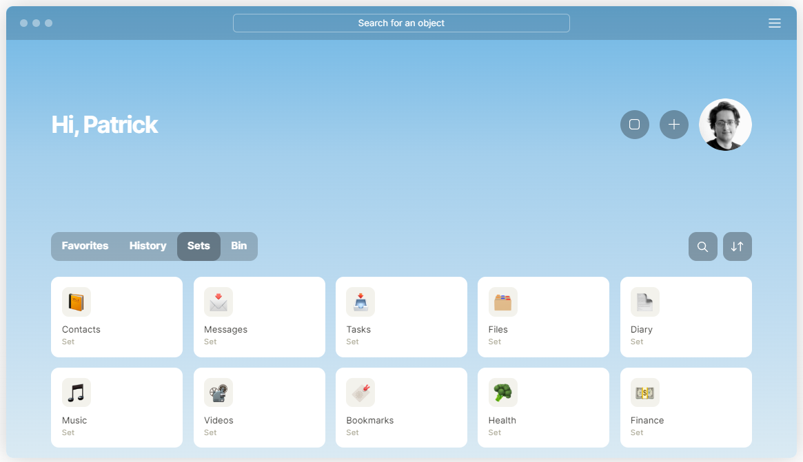

   
  
   
   

## Awesome AnyType Resources 

> 🎉 A curated collection of useful links, tutorials, and resources for the AnyType app – a knowledge management and organization tool. Explore guides, templates, and community-contributed content to enhance your experience with AnyType.

## 🧾 Contents

1. [Official Documentation](#📝official-documentation)
2. [Tutorials](#▶-youtube-tutorials)
3. [Community Templates](#🖼-community-templates)
4. [External Resources](#🔗external-resources)
5. [Contribution Guidelines](#contribution-guidelines)
6. [Our Repo Tutorials and Resources](#💿-our-repo-tutorials-and-resources)

---

## 📝Official Documentation 

- [Get the App](https://download.anytype.io/)
- [AnyType Documentation](https://docs.anytype.io/): Explore the official documentation for in-depth information on using AnyType, its features, and best practices.
- [Blog](https://blog.anytype.io/)
- [FAQ](https://anytype.io/faq)
- [join to contribute](https://anytype.io/contributors)

## 📪 Contacts

 [X](https://twitter.com/AnytypeLabs) |  [github](https://github.com/anyproto) |  [telegram](https://t.me/anytype)

---

## 💿 Our Repo Tutorials and Resources

* [Quick Start with Any type](Tutorial/Quck%20Start.md)

* [Comparison AnyType vs Notion Terms and Features](Tutorial/anytype-vs-notion-terms.md)

* [markdown sheat sheet](Tutorial/markdown-sheat-sheet.md)

## ▶ Youtube Tutorials

* [Getting Started with AnyType](https://www.youtube.com/@pianomacpower): A step-by-step guide for beginners to kickstart their journey with AnyType.
* [Our Review: Testing the PARA Method in Anytype](https://youtu.be/rgBS46Scw4Q?si=x2O78MTWyLh78epj): Our Review: Testing the PARA Method in Anytype
* [Anytype tutorial - Offline Notes Initial Setup +Tips (Jan 2024)](https://youtu.be/Ts4PyVZ1R7o?si=Q0UhWjhmRX-Wmdxi): Anytype tutorial - Offline Notes Initial Setup +Tips (Jan 2024)
* [Anytype: The Best Offline Alternative to Notion](https://youtu.be/pIWsKwEqG00?si=VmJh_ZXVbSa0L2LN): Anytype: The Best Offline Alternative to Notion
* [Can this app dethrone Notion? | Anytype First Look](https://youtu.be/xOGjnjL1SLU?si=Kh6QCcFAzSFYvADf):Can this app dethrone Notion? | Anytype First Look
* 

---

## 📄 Articles  

* [Why Anytype is the Future of Note-Taking
](https://medium.com/predict/why-anytype-is-the-future-of-note-taking-b75a98688192):Why Anytype is the Future of Note-Taking
* [Anytype App Review: A Notion Killing Notes App?](https://toolfinder.co/tools/anytype): Anytype App Review: A Notion Killing Notes App?
* [Anytype: An All-in-One Secure Open-Source App for Work and Productivity](https://news.itsfoss.com/anytype-open-beta/):Anytype: An All-in-One Secure Open-Source App for Work and Productivity
* [Anytype: Apple Notes on Steroids! | Review](https://shuomi.medium.com/anytype-apple-notes-on-steroids-review-4a7d3b654dbb): Anytype: Apple Notes on Steroids! | Review

---

## 🖼 Community Templates

 **coming Soon**

Browse and use templates created by the AnyType community to jumpstart your projects and workflows.

1. [Project Management Template](./templates/project-management.md): A template for organizing and managing projects within AnyType.

2. [Book Notes Template](./templates/book-notes.md): Take structured notes on books you read using this template.

---

## 🔗External Resources

Explore resources outside of official channels for additional insights and perspectives.

1. [AnyType Reddit Community](https://www.reddit.com/r/AnyType/): Join the Reddit community to connect with other AnyType users, ask questions, and share your experiences.

2. [AnyType Blog](https://blog.anytype.io/): Read the official blog for updates, tips, and feature highlights.

---

## Contribution Guidelines

Feel free to contribute by adding new links, tutorials, or resources. Follow these guidelines:

1. Fork the repository.
2. Create a new branch.
3. Add your content.
4. Create a pull request.

Let's build a comprehensive resource hub for the AnyType community together!

---

## Contributors

👏 A big thank you to the following individuals who have contributed to this project:

---

## License

This project is licensed under the [MIT License](LICENSE).

**🤩Happy organizing with AnyType!**

